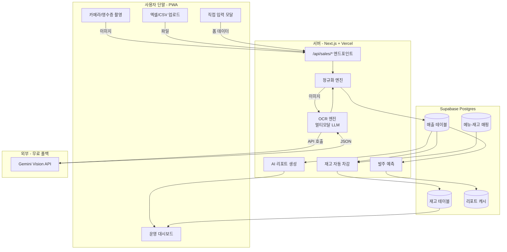
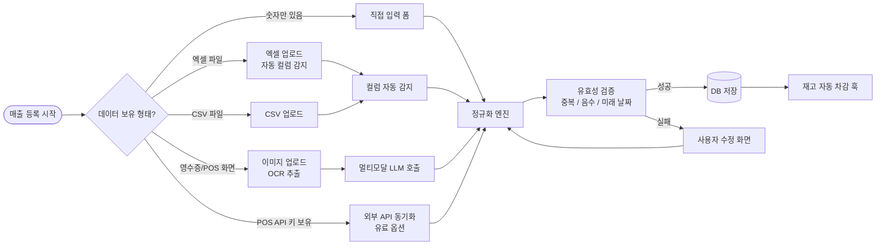
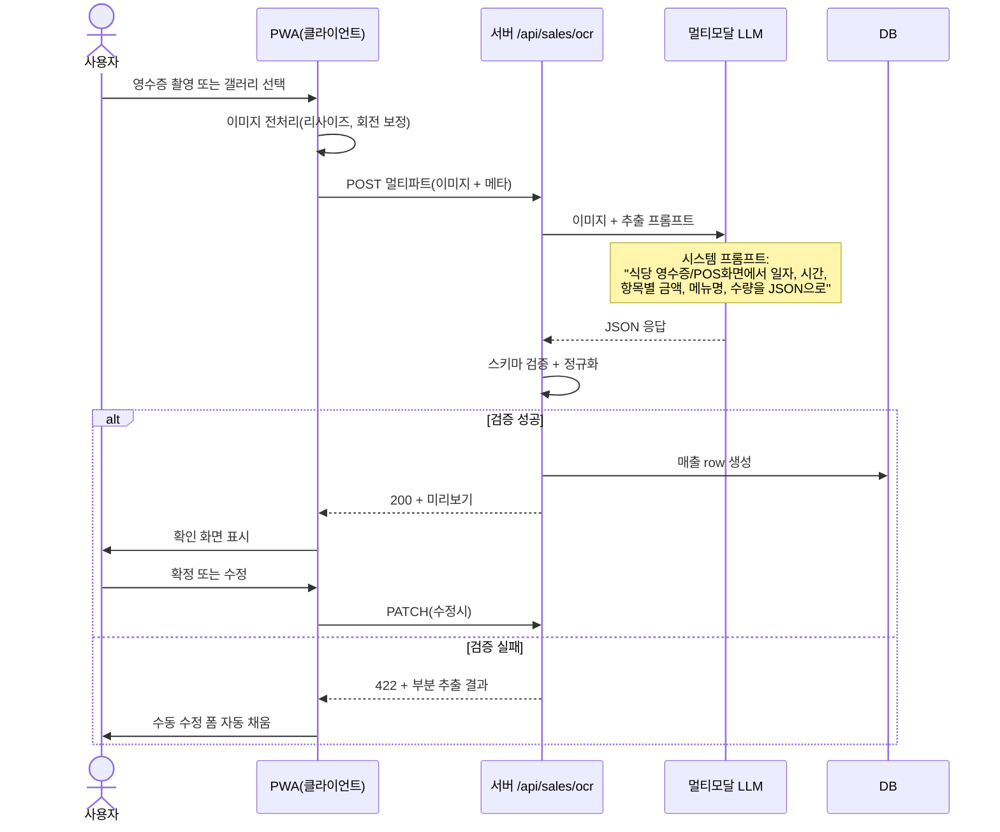
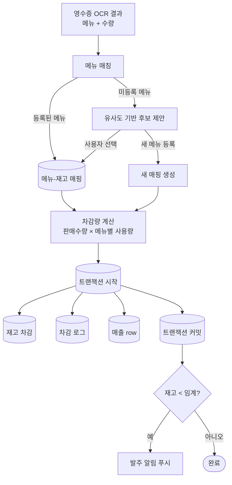
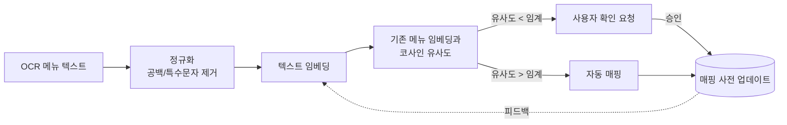
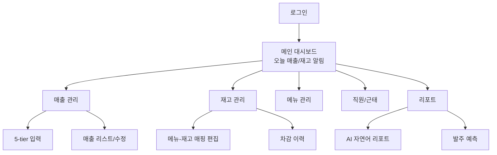
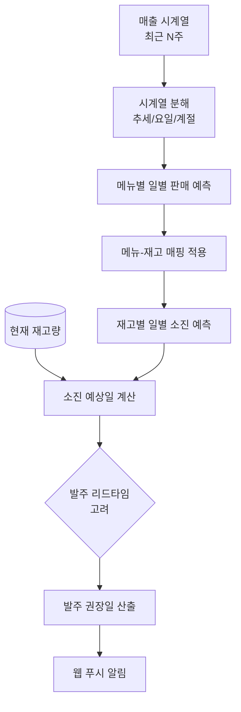
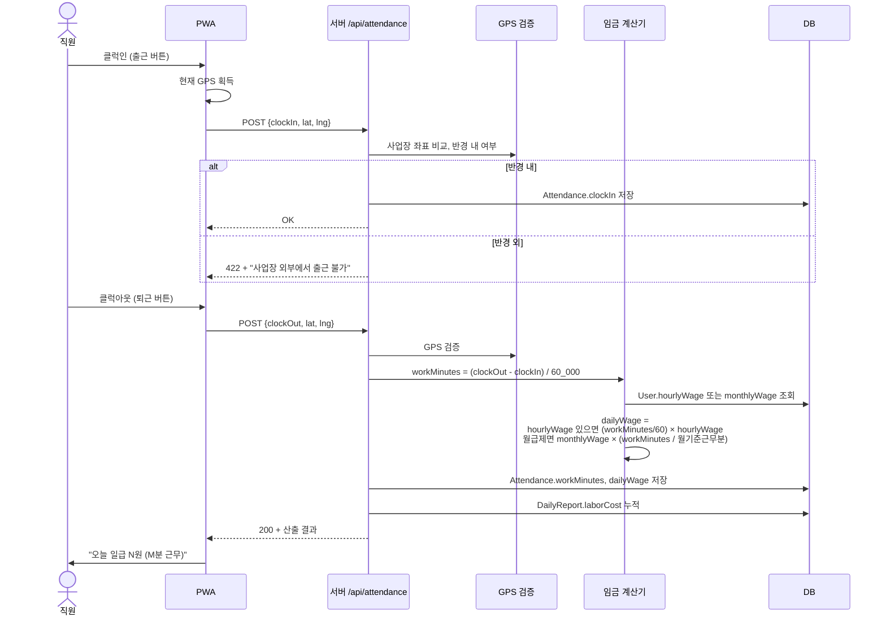
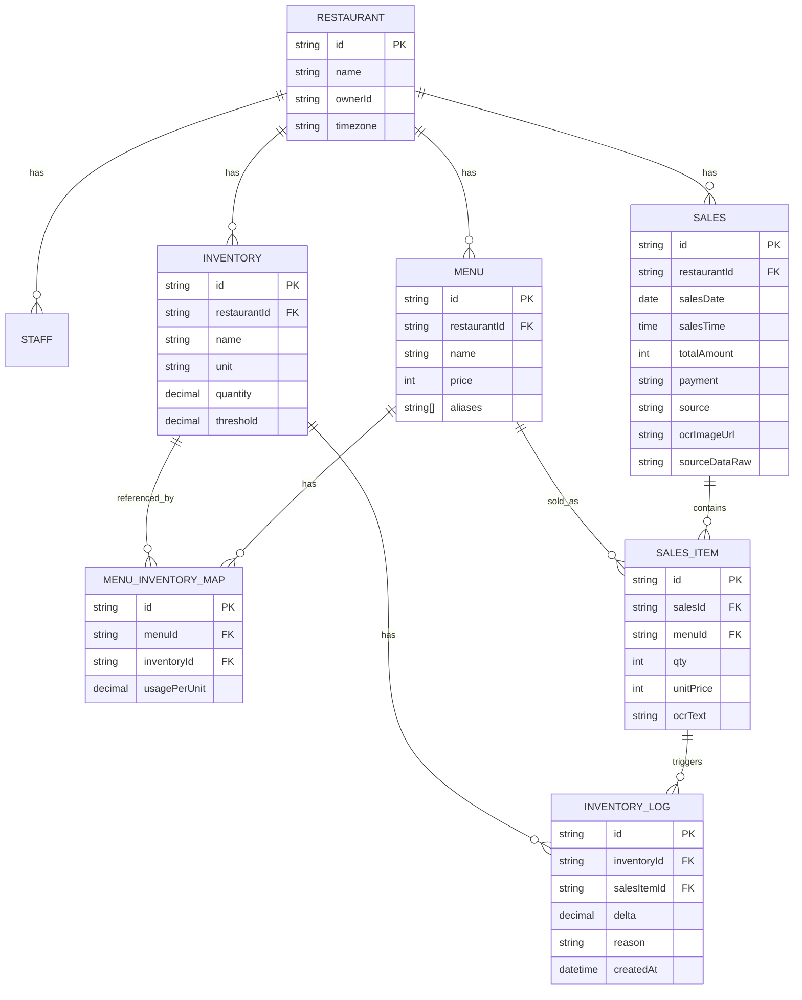

# 오토드림 — 특허 출원 설계서 초안

> 작성일: 2026-04-29
> 용도: 변리사 미팅 / 특허 출원 명세서 작성 기초 자료
> 형식: 텍스트 + Mermaid 도면 (변리사가 워드/한글로 옮기기 용이)

---

## 발명의 명칭 (안)

**식당 운영 데이터를 OCR 기반으로 자동 수집·정규화하여 매출 및 재고를 통합 관리하는 PWA 시스템 및 그 방법**

(축약형: "OCR 기반 식당 매출·재고 자동화 시스템")

---

## 0. 핵심 발명 포인트 요약 (5분 요약)

| # | 청구 후보 | 한 줄 요약 |
|---|---|---|
| 1 | **다단계 폴백 매출 입력** | POS/배달앱 환경이 다양해도 직접→엑셀→CSV→OCR 5단계 자동 폴백으로 100% 입력 가능 |
| 2 | **OCR 매출 자동 입력** | 영수증/POS 화면 캡처 → 멀티모달 LLM(Gemini)로 매출 추출 → 자동 등록 |
| 3 | **OCR 매출 → 재고 자동 차감** | OCR로 인식된 메뉴명을 사전 등록 메뉴-재고 매핑에 따라 자동 차감 |
| 4 | **메뉴-재고 자동 매핑 학습** | 매출 OCR에서 추출된 메뉴 텍스트를 점진적으로 학습해 재고 매핑 정확도 향상 |
| 5 | **이종 데이터 정규화 엔진** | 직접 입력/엑셀/CSV/OCR 결과를 통합 포맷으로 변환하는 자동 컬럼 감지 |
| 6 | **PWA 기반 통합 운영 대시보드** | 매출/재고/직원/리포트를 단일 PWA에서 처리, 오프라인 가능 |
| 7 | **AI 매출 리포트 자동 생성** | 누적 매출에서 패턴/이상치를 LLM으로 분석해 일/주/월 단위 자연어 리포트 자동 생성 |
| 8 | **재고 발주 시점 예측** | 매출 시계열 + 요일/계절성 + 메뉴 판매량으로 발주 시점/수량 예측 |
| 9 | **메뉴 레시피 기반 자동 차감 + 실시간 원가율 산출** | 메뉴 1개 판매 시 등록된 레시피대로 다중 재고 자동 차감 + 판매 시점 원가 스냅샷 + 메뉴별/전체 원가율 자동 계산 |
| 10 | **출퇴근 GPS+시간 기반 일급 자동 산출** | 직원 클럭아웃 시 GPS 검증된 근무시간을 시급/월급에 자동 환산하여 일급 즉시 산출, 일일 손익 리포트에 자동 반영 |
| 11 | **고정비용 엑셀 일괄 업로드 + 자동 카테고리 분류** | 식당 운영자가 보유한 임의 형식 엑셀(임대료/공과금 등)을 컬럼명 휴리스틱으로 자동 매핑하여 고정비용으로 일괄 등록, 일할/월할 계산 자동 적용 |

---

## 1. 기술 분야

본 발명은 식당 운영 관리 분야, 보다 구체적으로는 **다양한 형태(영수증, 엑셀, CSV, POS 화면 캡처 등)로 존재하는 매출 데이터를 OCR 및 멀티모달 인공지능 기반으로 자동 추출·정규화하여 매출 및 재고를 통합 관리하는 PWA(Progressive Web App) 시스템 및 그 방법**에 관한 것이다.

---

## 2. 배경 기술 및 종래 기술의 문제점

**2.1 종래 기술**
- 식당 운영자는 매출 관리를 위해 다음 중 하나를 사용:
  (a) 수기 장부 — 누락 / 오기 빈번
  (b) POS사 자체 통계 — POS사별 데이터 포맷 상이, 식당당 평균 1~3개 POS·배달앱 병용
  (c) 회계 SaaS (예: 캐셔플) — 가격 부담, 영세 식당 보급률 낮음
  (d) 엑셀 수동 정리 — 시간 소요, 휴먼 에러

- 재고 관리는 별도 시스템 또는 수기 처리. 매출과 연동되지 않아 실시간 차감 불가.

**2.2 문제점**
- POS/배달앱 별로 데이터 형식이 모두 달라 단일 통합이 어려움
- 영세 식당주는 IT 전문 지식 부족 → 자동 연동 솔루션을 도입하기 어려움
- 영수증 사진을 매출 시스템에 자동으로 입력하는 솔루션 부재
- 매출과 재고가 분리 운영되어 재고 차감/발주 시점 예측 부정확
- 시중 솔루션 대부분 데스크톱 또는 별도 단말 필요 → 모바일 환경 대응 부족

**2.3 본 발명이 해결하고자 하는 과제**
- (1) **다양한 데이터 입력 환경에 모두 대응** — POS/배달앱 종류 무관, 식당주의 IT 숙련도와 무관하게 매출 등록 가능
- (2) **영수증 한 장만 찍어도 매출+재고가 동시 처리** — 단일 사진 → 매출 등록 + 재고 차감을 일괄 자동화
- (3) **PWA로 별도 단말/앱 설치 부담 제거** — 휴대폰 브라우저에서 바로 사용
- (4) **AI 기반 자동 분석** — 누적 데이터에서 패턴/이상을 자동 추출해 운영 의사결정 지원

---

## 3. 발명의 구성 — 시스템 전체 구성도



**도 1. 시스템 전체 구성도**

---

## 4. 청구 후보별 상세 — 도면 + 설명

### 청구 후보 1: 다단계 폴백 매출 입력 방법

**기술적 사상**: 식당주가 사용 중인 POS/배달앱 종류 또는 IT 숙련도와 무관하게, **5단계 입력 방식**(직접 입력 / 엑셀 업로드 / CSV 업로드 / OCR 이미지 입력 / 외부 API)을 단일 인터페이스에서 제공하고, **사용자가 보유한 데이터 형식에 따라 자동 또는 수동으로 폴백**하는 방법.

**도 2. 4-tier 매출 입력 흐름도**


**핵심 청구 포인트**:
- 단일 화면(또는 모달)에서 다섯 가지 입력 방식이 모두 노출됨
- 자동 컬럼 감지: 엑셀/CSV의 컬럼명이 다양해도(예: "날짜"·"date"·"일자") 휴리스틱으로 자동 매핑
- 모든 입력은 동일한 정규화 엔진 통과 → 후속 처리(재고/리포트) 일관성 보장

---

### 청구 후보 2: OCR 기반 매출 자동 입력 방법

**기술적 사상**: 사용자가 식당의 **영수증, POS 단말 화면, 배달앱 매출 통계 화면 등을 휴대폰으로 촬영하거나 스크린샷을 업로드**하면, 멀티모달 LLM(예: Gemini Vision)이 이미지 내 매출 정보(일자, 시간, 항목별 금액, 결제 수단, 메뉴명, 수량)를 구조화된 JSON으로 추출하여 매출 시스템에 자동 등록하는 방법.

**도 3. OCR 매출 자동 입력 시퀀스**


**핵심 청구 포인트**:
- 휴대폰 카메라 또는 갤러리 사진 모두 입력 가능
- 멀티모달 LLM에 식당 도메인 특화 프롬프트를 적용해 한국어 영수증 인식률 향상
- 추출 결과를 사전 정의된 JSON 스키마로 강제 → 후속 시스템 연결 안정성
- 인식 실패 시 부분 결과를 수정 폼에 미리 채워 사용자 보정 시간 단축

---

### 청구 후보 3: OCR 매출 데이터를 이용한 재고 자동 차감 방법

**기술적 사상**: 청구 후보 2의 OCR 결과에서 추출된 **메뉴명 및 수량**을 이용하여, 사전에 등록된 **메뉴-재고 매핑(메뉴 1개당 사용되는 재고 항목과 수량)**에 따라 데이터베이스의 재고 잔량을 **단일 트랜잭션에서 자동 차감**하는 방법.

**도 4. OCR → 재고 차감 자동화 플로우**


**핵심 청구 포인트**:
- 단일 영수증 한 장으로 **매출 + 재고 + 알림이 한 번에 처리**
- 메뉴 매칭 실패 시 유사도(레벤슈타인 거리, 임베딩 코사인 등)로 후보 제안
- 트랜잭션 무결성 — 매출/재고/로그가 원자적 처리
- 임계값 기반 자동 발주 알림 트리거

---

### 청구 후보 4: 메뉴-재고 매핑 자동 학습 방법

**기술적 사상**: OCR로 인식된 메뉴 텍스트를 누적 저장하고, **빈출 패턴 + 사용자 매핑 이력**으로부터 매핑 사전을 점진적으로 강화하는 방법. 동일 메뉴가 다양한 표기(예: "비빔밥", "비빔밥(곱)", "Bibimbap")로 들어와도 동일 재고 항목에 매핑되도록 학습.

**도 5. 메뉴-재고 매핑 학습 사이클**


**핵심 청구 포인트**:
- 콜드 스타트(매핑 미존재) 상태에서도 점진적 학습으로 정확도 향상
- 텍스트 임베딩 + 사용자 피드백 결합한 하이브리드 매핑
- 매핑 정확도 메트릭(Precision/Recall)을 누적 기록

---

### 청구 후보 5: 이종 매출 데이터 정규화 엔진

**기술적 사상**: 직접 입력 / 엑셀 / CSV / OCR / 외부 API 등 **출처가 상이하고 컬럼명/구조가 제각각인 매출 데이터**를 단일 내부 스키마로 변환하는 엔진. 컬럼명 휴리스틱(한국어/영어 별칭 사전 + 정규식)과 데이터 타입 추론을 결합.

**도 6. 정규화 엔진 내부 구조**
```mermaid
flowchart LR
  In1[직접 입력] --> Adapter1[Direct Adapter]
  In2[엑셀] --> Adapter2[XLSX Adapter<br/>+ 컬럼 자동 감지]
  In3[CSV] --> Adapter3[CSV Adapter]
  In4[OCR JSON] --> Adapter4[OCR Adapter]
  In5[외부 API] --> Adapter5[POS Adapter]

  Adapter1 --> Schema[통합 스키마<br/>{date, time, items[], total, payment}]
  Adapter2 --> Schema
  Adapter3 --> Schema
  Adapter4 --> Schema
  Adapter5 --> Schema

  Schema --> Validator[검증<br/>중복/음수/누락]
  Validator --> Normalize[단위 통일<br/>원/시간대/일자형식]
  Normalize --> Store[(통합 테이블)]
```

**핵심 청구 포인트**:
- 컬럼명 자동 매핑 사전: "일자|date|날짜|영업일|등록일" → `date`
- 데이터 타입 자동 추론: "₩12,000" / "12000원" / "12,000.00" → 정수 12000
- 시간대 정규화: 다양한 형식(yyyy-mm-dd / yy.m.d / m/d/yyyy) → ISO 8601

---

### 청구 후보 6: PWA 기반 식당 통합 관리 시스템

**기술적 사상**: **앱스토어 등록 없이 단일 URL로 접근 가능**하면서 **홈 화면 설치 시 네이티브 앱처럼 동작**하고, 매출/재고/직원/메뉴/리포트를 단일 인터페이스로 제공하는 PWA 시스템.

**도 7. PWA 운영 대시보드 화면 흐름**


**핵심 청구 포인트**:
- 단일 PWA로 5종 이상의 운영 도메인 통합 (매출/재고/메뉴/직원/리포트)
- 서비스 워커로 오프라인 일부 기능 (매출 임시 저장 → 재접속 시 동기화)
- iOS / Android / 데스크톱 모두 단일 코드베이스로 동작
- 알림(웹 푸시) 통합

---

### 청구 후보 7: AI 매출 리포트 자동 생성 방법

**기술적 사상**: 누적된 매출 시계열에서 **이상치, 추세, 패턴(요일/시간대/메뉴별)**을 추출하고, 이를 LLM 프롬프트에 주입하여 식당주가 즉시 이해할 수 있는 **자연어 한국어 리포트**를 일/주/월 단위로 자동 생성. 단순 통계 출력이 아니라 "왜 어제 매출이 떨어졌는가" 같은 진단형 텍스트 생성.

**도 8. AI 리포트 생성 파이프라인**


**핵심 청구 포인트**:
- 통계만 던지지 않고 LLM에게 **식당 도메인 컨텍스트**를 주입한 진단형 리포트
- 캐시 전략으로 LLM 호출 비용 절감 (동일 기간/동일 데이터는 재사용)
- 사용자 피드백("도움 됐음/별로") 수집 → 프롬프트 개선 루프

---

### 청구 후보 8: 재고 발주 시점 자동 예측 방법

**기술적 사상**: 메뉴별 매출 시계열 + 메뉴-재고 매핑 + **요일/계절성 + 영업 정지일**을 결합해, 각 재고 항목의 **소진 예상일과 권장 발주 수량**을 계산하여 사전 발주 알림.

**도 9. 발주 예측 알고리즘**


**핵심 청구 포인트**:
- 단순 평균이 아닌 시계열 분해로 요일/계절 효과 보정
- 발주 리드타임 + 안전 재고 수준을 사용자별 설정 가능
- 매출 폭증/이벤트일 자동 가중치 조정

---

### 청구 후보 9: 메뉴 레시피 기반 자동 차감 + 실시간 원가율 산출 방법

**기술적 사상**: 식당 운영자가 사전에 등록한 **메뉴-재고 레시피(메뉴 1개당 사용 재고 항목과 그 사용량)**를 기반으로, 매출 1건이 등록될 때 메뉴별 판매 수량과 레시피를 곱하여 **다중 재고 항목을 단일 트랜잭션 내에서 동시 차감**한다. 차감 시점에 각 재고의 단가를 스냅샷으로 저장하여 **판매 시점 원가**를 보존하고, 이를 활용해 메뉴별 / 카테고리별 / 전체 식당의 **실시간 원가율(food cost ratio)**을 자동으로 산출한다.

**도 11. 메뉴 레시피 기반 자동 차감 + 원가율 산출 흐름**
```mermaid
flowchart TB
  Sale[매출 1건 등록<br/>OCR/직접/엑셀/CSV] --> ItemList[매출 항목 목록<br/>SaleItem N개]
  ItemList --> Loop{각 SaleItem 처리}
  Loop --> RecipeLookup[(MenuRecipe<br/>메뉴별 레시피)]
  RecipeLookup --> ComputeQty[차감량 계산<br/>판매수량 × 레시피 사용량]
  ComputeQty --> CostSnap[재고별 unitPrice 스냅샷]
  CostSnap --> CostAtSale[SaleItem.costAtSale 저장]

  ComputeQty --> Tx[트랜잭션 시작]
  Tx --> InvUpdate[(재고 currentStock 감산)]
  Tx --> InvLog[(InventoryLog OUT 기록)]
  Tx --> SaleSave[(SaleItem.costAtSale 커밋)]
  Tx --> Commit[트랜잭션 커밋]

  Commit --> Compute[원가율 산출]
  Compute --> Per[메뉴별 원가율<br/>= Σ(qty × unitPrice) / unitSalePrice]
  Compute --> Total[전체 원가율<br/>= Σ costAtSale / Σ subtotal]
  Compute --> Trend[추세 분석<br/>식자재 가격 변동 영향]

  Per --> Dashboard[대시보드 표시]
  Total --> Dashboard
  Trend --> AlertCost{원가율 ≥ 임계?}
  AlertCost -->|예| Push[가격 인상/메뉴 조정 권고 알림]
```

**핵심 청구 포인트**:
- **다중 재고를 단일 트랜잭션으로 차감** — 메뉴 1개에 N개 식자재가 묶여도 원자적 처리
- **판매 시점 원가 스냅샷** — 식자재 단가가 미래에 변경되어도 과거 매출의 원가는 보존되어 정확한 손익 분석 가능
- **실시간 원가율 자동 산출** — 메뉴별 / 카테고리별 / 일/주/월 단위로 즉시 조회
- **임계 초과 시 자동 권고** — 원가율 급등 시 가격 인상/메뉴 조정 푸시

**공식**:
- 메뉴 i의 1개 원가 = Σ_j (recipe[i,j].qtyUsed × inventory[j].unitPrice)
- 메뉴 i의 원가율 = 1개 원가 / menu[i].price
- 전체 식당 원가율 = Σ_k (saleItem[k].costAtSale × saleItem[k].qty) / Σ_k saleItem[k].subtotal

---

### 청구 후보 10: 출퇴근 GPS·시간 기반 일급 자동 산출 방법

**기술적 사상**: 직원의 휴대폰 PWA에서 클럭인/클럭아웃 시 **GPS 좌표 + 사업장 등록 좌표**를 비교하여 정해진 반경(예: 50m) 내에서만 인정. 클럭아웃 시점에 클럭인부터의 경과 시간(분)을 자동 계산하고, 사용자에 등록된 **시급 또는 월급**을 기준으로 일급을 즉시 환산하여 저장. 산출된 일급은 **일일 손익 리포트**에 자동 반영되어 별도 급여 관리 시스템 없이 인건비를 운영 손익과 동기화.

**도 12. GPS·시간 기반 일급 자동 산출 흐름**


**핵심 청구 포인트**:
- **GPS 반경 검증** — 출근 위치 부정 방지 (재택 등 사전 허용 구역도 설정 가능)
- **시급제·월급제 자동 분기** — 사용자 설정에 따라 다른 환산식 적용
- **일일 손익 리포트 자동 누적** — 인건비가 매출과 같은 화면에서 즉시 비교

---

### 청구 후보 11: 고정비용 엑셀 일괄 업로드 + 자동 카테고리 분류 방법

**기술적 사상**: 식당주가 보유한 **임의 형식의 고정비 엑셀(임대료/공과금/구독료/직원 월급 등)**을 업로드하면, **컬럼명 휴리스틱**(한국어/영어 별칭 사전)과 **데이터 타입 추론**으로 내부 스키마(이름/카테고리/금액/납부일)에 자동 매핑하고, 키워드 기반으로 카테고리(임대료/공과금/통신/인건비/기타)를 자동 분류하여 **고정비용 테이블에 일괄 등록**. 등록된 고정비는 사용자 설정에 따라 **일할/월할 계산**되어 일일 손익 리포트에 자동 반영.

**도 13. 고정비용 엑셀 자동 등록 흐름**


**핵심 청구 포인트**:
- **임의 컬럼 형식** 수용 — "임대료"·"월세"·"고정비용" 같이 사용자별로 다른 명명도 통합
- **카테고리 자동 분류** — "전기" → 공과금, "월세" → 임대료, "월급" → 인건비
- **일할 vs 월할 자동 결정** — `isDailyCalc` 플래그에 따라 일일 손익에 분산 반영
- 직접 입력 외 엑셀로 한 번에 수십 건 등록 가능

---

## 5. 데이터 구조 — ER 다이어그램



**도 10. ER 다이어그램**

---

## 6. 발명의 효과

1. **데이터 입력 진입 장벽 제거** — POS/배달앱 종류, 식당주 IT 숙련도 무관하게 100% 매출 등록 가능
2. **단일 영수증 → 매출+재고 일괄 처리** — 별도 재고 시스템 운영 불필요, 시간 절감
3. **PWA로 설치 부담 0** — 휴대폰 브라우저로 즉시 사용
4. **AI 자연어 리포트** — 통계 해석 능력 없이도 운영 의사결정 가능
5. **발주 예측** — 재고 부족/과잉 손실 감소
6. **메뉴-재고 자동 학습** — 사용 기간이 길수록 정확도 자동 상승

---

## 7. 발명을 실시하기 위한 구체적인 내용

### 7.1 시스템 환경
- 클라이언트: PWA (Next.js 16 App Router, Tailwind CSS, Service Worker)
- 서버: Next.js Route Handlers, Vercel Edge/Serverless
- DB: PostgreSQL (Supabase)
- AI: 멀티모달 LLM (Gemini 2.5 Flash 또는 동등 이상)
- 인증: NextAuth v5 (이메일/소셜 로그인)
- 이미지: Cloudinary (영수증 원본 저장 옵션)

### 7.2 OCR 추출 프롬프트 (예시)
```
당신은 한국 식당 영수증·POS 화면 인식 전문가입니다.
이미지에서 다음 정보를 추출해 JSON으로 응답하세요. 항목이 없으면 null.

스키마:
{
  "date": "YYYY-MM-DD" | null,
  "time": "HH:MM" | null,
  "items": [{ "name": string, "qty": number, "unitPrice": number }],
  "total": number | null,
  "payment": "CARD" | "CASH" | "TRANSFER" | "OTHER" | null,
  "merchant": string | null
}

규칙:
- 가격은 숫자만 (콤마/원 기호 제거)
- 메뉴명은 원문 그대로 (예: "비빔밥(특)")
- 합계가 항목 합과 일치하지 않으면 합계는 null
```

### 7.3 정규화 엔진 컬럼 매핑 사전 (예시)
| 내부 필드 | 매칭 정규식 (한국어) | 매칭 정규식 (영어) |
|---|---|---|
| date | `일자\|날짜\|영업일\|등록일\|매출일` | `date\|day\|reportDate` |
| amount | `금액\|매출\|총액\|합계\|결제금액` | `amount\|total\|sales\|revenue` |
| payment | `결제수단\|결제유형\|지불방법` | `payment\|method` |
| menu | `메뉴\|품목\|상품\|항목` | `menu\|item\|product` |
| qty | `수량\|개수` | `qty\|quantity\|count` |

### 7.4 메뉴 매칭 임계값 (예시)
- 코사인 유사도 ≥ 0.92 → 자동 매핑
- 0.75 ≤ 유사도 < 0.92 → 사용자 확인 후 매핑 (제안)
- 유사도 < 0.75 → 새 메뉴 등록 유도

### 7.5 발주 예측 모델 (예시)
- 시계열 분해: STL(Loess) 또는 단순 7일 이동평균
- 일별 메뉴 판매량 예측 → 메뉴-재고 매핑 적용
- 권장 발주일 = 소진 예상일 - (리드타임 + 안전일수)

---

## 8. 청구범위 후보 (변리사 검토용 초안)

### 청구항 1 (방법항)
**식당 운영 데이터를 OCR 기반으로 자동 처리하는 방법**으로서,
(a) 사용자 단말로부터 영수증 또는 POS 화면 이미지를 수신하는 단계;
(b) 상기 이미지를 멀티모달 인공지능 모델에 전송하여 일자, 시간, 메뉴명, 수량, 금액을 포함하는 구조화 데이터를 추출하는 단계;
(c) 상기 구조화 데이터에서 메뉴명을 추출하여 사전 등록된 메뉴-재고 매핑 사전을 참조하는 단계;
(d) 매핑된 재고 항목의 잔량에서 매출 수량에 대응하는 양을 감산하는 단계;
(e) 상기 (b) 내지 (d) 단계를 단일 데이터베이스 트랜잭션으로 처리하는 단계;
를 포함하는 것을 특징으로 하는 방법.

### 청구항 2 (종속)
청구항 1에 있어서, 상기 메뉴-재고 매핑 사전은 텍스트 임베딩 기반 유사도 매칭과 사용자 피드백을 결합하여 점진적으로 갱신되는 것을 특징으로 하는 방법.

### 청구항 3 (방법항 — 폴백)
**다단계 폴백 매출 입력 방법**으로서,
(a) 단일 사용자 인터페이스에서 직접 입력, 엑셀 업로드, CSV 업로드, 이미지 OCR 입력의 4가지 입력 경로를 동시 제공하는 단계;
(b) 사용자가 선택한 경로별 어댑터를 통해 데이터를 수집하는 단계;
(c) 컬럼명 사전 + 정규식 + 데이터 타입 추론을 결합한 정규화 엔진을 통해 단일 내부 스키마로 변환하는 단계;
(d) 변환된 데이터에 대해 중복, 음수, 미래 일자를 검증하는 단계;
(e) 검증 실패 시 부분 추출 결과로 사용자 수정 폼을 자동 채우는 단계;
를 포함하는 방법.

### 청구항 4 (시스템항)
**식당 매출·재고 통합 관리 시스템**으로서,
- 영수증 또는 POS 이미지를 수신하는 입력부;
- 멀티모달 인공지능 모델과 통신해 매출 정보를 추출하는 OCR 처리부;
- 직접 입력, 엑셀, CSV, OCR 결과를 단일 스키마로 변환하는 정규화 엔진;
- 메뉴-재고 매핑 사전을 저장하는 저장부;
- 매출 데이터로부터 메뉴를 추출해 재고를 자동 차감하는 재고 동기화부;
- 재고 잔량이 임계 미만일 때 사용자 단말로 푸시 알림을 전송하는 알림부;
- 매출 시계열에서 재고 소진 예상일을 산출하는 예측부;
를 포함하는 것을 특징으로 하는 시스템.

### 청구항 5 (장치항)
청구항 4의 시스템이 PWA(Progressive Web App)로 구현되어, 사용자 단말의 웹 브라우저에서 별도 앱 설치 없이 동작하고, 서비스 워커를 통해 일부 기능이 오프라인에서 동작하는 것을 특징으로 하는 시스템.

### 청구항 6 (방법항 — AI 리포트)
**식당 매출 데이터 기반 자연어 리포트 자동 생성 방법**으로서,
(a) 매출 시계열에 대해 추세, 요일성, 시간대성, 메뉴별 분포의 통계를 산출하는 단계;
(b) z-score 또는 이동평균 대비 임계 이상의 편차를 이상치로 식별하는 단계;
(c) 산출된 통계 및 이상치를 식당 도메인 컨텍스트가 주입된 프롬프트에 포함하여 LLM에 입력하는 단계;
(d) LLM이 생성한 자연어 텍스트를 일/주/월 단위 리포트로 캐시하고 사용자 단말에 전송하는 단계;
를 포함하는 방법.

### 청구항 7 (기록 매체항)
청구항 1, 3, 6, 8, 9, 10 중 어느 한 방법을 컴퓨터에 실행시키기 위한 프로그램이 기록된, 컴퓨터로 읽을 수 있는 기록 매체.

### 청구항 8 (방법항 — 메뉴 레시피 기반 자동 차감 + 원가율 산출)
**메뉴 레시피 기반 다중 재고 자동 차감 및 실시간 원가율 산출 방법**으로서,
(a) 식당 운영자로부터 메뉴 1개당 사용되는 복수의 재고 항목과 각각의 사용량으로 구성된 레시피를 등록받는 단계;
(b) 매출 1건이 등록될 때, 해당 매출에 포함된 각 메뉴의 판매 수량과 (a)단계에서 등록된 레시피를 곱하여 차감 대상 재고 항목별 차감량을 산출하는 단계;
(c) 단일 데이터베이스 트랜잭션 내에서, 산출된 차감량만큼 복수의 재고 잔량을 동시에 감산하고 변동 로그를 기록하는 단계;
(d) 차감 시점에 각 재고 항목의 단가를 매출 항목 레코드에 스냅샷으로 저장하는 단계;
(e) 저장된 스냅샷을 합산하여 메뉴별, 카테고리별, 식당 전체의 원가율(food cost ratio)을 산출하고 대시보드에 표시하는 단계;
(f) 원가율이 사전 설정된 임계값을 초과할 경우 사용자 단말로 알림을 전송하는 단계;
를 포함하는 방법.

### 청구항 9 (방법항 — 출퇴근 GPS·시간 기반 일급 자동 산출)
**식당 직원의 출퇴근 데이터로부터 일급을 자동 산출하는 방법**으로서,
(a) 직원 단말로부터 출근 요청을 수신할 때 GPS 좌표를 수신하는 단계;
(b) 사업장에 등록된 좌표 및 반경과 비교하여 반경 내일 때만 출근으로 인정하는 단계;
(c) 퇴근 요청을 동일하게 GPS 검증한 후, 출근 시각과의 차이를 분 단위 근무 시간으로 산출하는 단계;
(d) 직원에 등록된 시급 또는 월급 정보를 조회하여 시급제는 (근무분/60)×시급, 월급제는 월급×(근무분/월기준근무분)으로 일급을 환산하는 단계;
(e) 환산된 일급을 일일 손익 리포트의 인건비 항목에 자동 누적하는 단계;
를 포함하는 방법.

### 청구항 10 (방법항 — 고정비용 엑셀 자동 등록)
**고정비용 엑셀 파일을 자동 인식하여 일괄 등록하는 방법**으로서,
(a) 사용자로부터 임의 형식의 엑셀 파일을 수신하는 단계;
(b) 엑셀의 컬럼명을 한국어/영어 별칭 사전과 비교하여 이름, 카테고리, 금액, 납부일, 일할계산여부의 내부 필드로 자동 매핑하는 단계;
(c) 행별 데이터에 대해 데이터 타입을 추론하고, 텍스트 키워드 사전(예: "전기"→공과금, "월세"→임대료, "월급"→인건비)으로 카테고리를 자동 분류하는 단계;
(d) 매핑 결과를 미리보기 화면으로 사용자에게 제공하고, 사용자 확인 후 일괄 등록 트랜잭션을 실행하는 단계;
(e) 등록된 고정비용을 일할/월할 계산 플래그에 따라 일일 손익 리포트에 분산 반영하는 단계;
를 포함하는 방법.

---

## 9. 변리사 미팅 시 강조할 차별화 포인트

1. **국내 영세 식당 환경 특화** — POS 종류 무관 / IT 미숙련 사용자 / 다양한 매출 채널(매장+배달앱) 동시 처리. 이 조합은 기존 솔루션이 거의 안 다룸.
2. **단일 영수증 → 매출+재고+알림 일괄 처리** — 분리된 시스템들의 통합은 종래 기술 대비 명확한 효과.
3. **PWA + AI 결합** — 설치 부담 X + 진단형 자연어 리포트는 현재 식당 SaaS 시장에서 흔하지 않은 조합.
4. **점진적 매핑 학습** — 사용 기간이 길수록 정확도 향상, 데이터 네트워크 효과.

---

## 10. 추가 출원 검토 가능한 인접 발명 (메모)

- 영수증 이미지 위치/회전 자동 보정 + 가장자리 검출 알고리즘 (이미지 처리 단독 출원 검토)
- 식당주가 영업 후 일과 마감 시점에 자동으로 당일 매출 집계 + 익일 발주 제안을 푸시로 전달하는 "일일 마감 자동화" 워크플로 (방법 출원)
- 다중 매장(프랜차이즈) 본부-가맹 데이터 동기화 구조 (개별 출원)
- 카카오 알림톡과 PWA 푸시를 결합한 "식당주 응대 자동화" 채널 라우팅 (방법 출원)

---

## 11. 진행 권장 순서

1. **변리사 1차 미팅** — 본 문서 + 실제 동작 시연 (https://restraunt-ebon-phi.vercel.app)으로 청구 후보 8개 중 등록 가능성 평가
2. **선행 기술 조사 (변리사 의뢰)** — 특히 POS·OCR·재고 자동화 영역. 1~2주 소요.
3. **출원 우선순위 결정** — 1건 묶음 출원 vs 핵심 1~2건만 별도 출원
4. **명세서 정식 작성** — 변리사가 본 문서 기반으로 형식 작성, 도면 정식화
5. **출원 → 심사청구 → 등록** (1~3년)

---

> **Note**: 이 문서는 변리사가 정식 명세서를 작성할 때 사용하는 **기초 자료**입니다. 청구범위는 변리사 검토 후 등록 가능성을 높이기 위해 표현이 조정될 것입니다. 최종 도면은 변리사가 흑백 선화 형식으로 재작도하는 것이 일반적이며, 본 문서의 Mermaid는 의미 전달용입니다.
