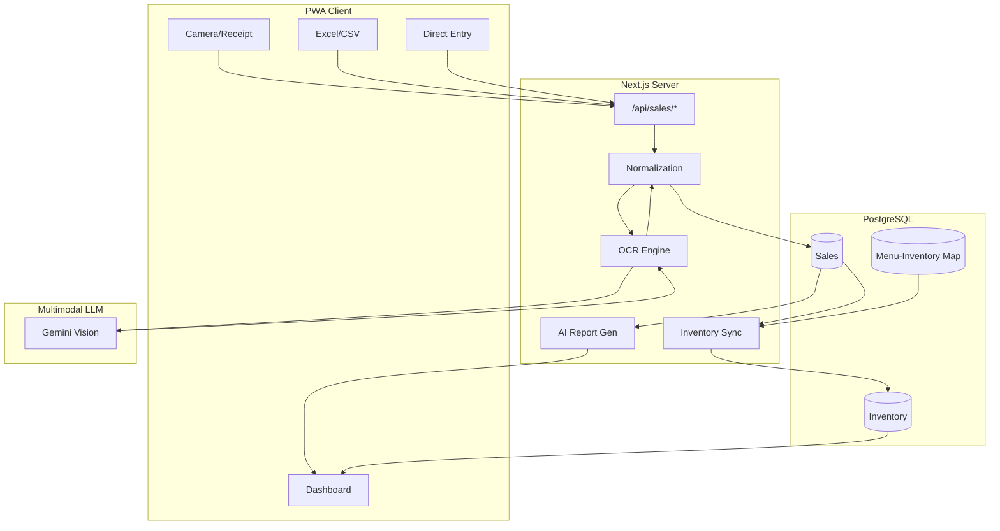
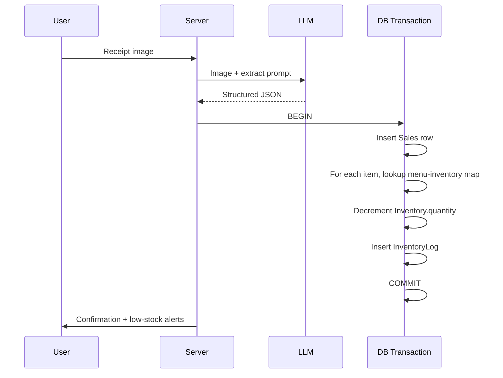
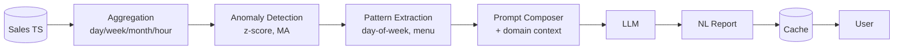

# AutoDream — Patent Application Draft (English)

> For overseas filing review (PCT, USPTO, JPO, EPO)
> Date: 2026-04-29

---

## Title of Invention

**A PWA-based System and Method for Integrated Restaurant Sales and Inventory Management via OCR-driven Automated Data Collection and Normalization**

---

## Field of the Invention

The present invention relates to restaurant operations management, more specifically to **a Progressive Web App (PWA) system and method that automatically extracts and normalizes sales data from heterogeneous sources (receipts, POS screens, Excel/CSV files) using multimodal Large Language Models (LLMs), and integrates sales recording with automatic inventory deduction within a single transaction**.

---

## Background of the Invention

Restaurant owners face fragmented challenges in operational data management:

1. **Heterogeneous POS environments**: Each restaurant uses 1–3 different POS systems and 2–4 delivery apps, each with proprietary data formats.
2. **Manual reconciliation**: No single system unifies sales across all channels; restaurant owners spend 30–60 minutes daily on manual data entry.
3. **Inventory disconnected from sales**: Conventional systems store sales and inventory separately, requiring duplicate entry and causing real-time stock inaccuracy.
4. **Mobile-first gap**: Existing solutions assume desktop or POS-terminal access; small restaurants without POS infrastructure are underserved.
5. **No diagnostic insight**: Existing systems display charts/tables but require statistical literacy to interpret.

---

## Problems Solved

- **(P1)** Universal compatibility regardless of POS, delivery app, or owner's IT literacy
- **(P2)** Single receipt photo triggers sales registration + inventory deduction + reorder alert atomically
- **(P3)** No app installation overhead — operates as PWA on standard mobile browsers
- **(P4)** AI-generated natural-language diagnostic reports replacing chart-only outputs

---

## Summary of the Invention

The invention comprises:

1. **A multi-tier sales input fallback method** providing direct entry, Excel upload, CSV upload, OCR image input, and external API integration in a unified interface;
2. **A receipt OCR sales recording method** using a multimodal LLM with restaurant-domain prompting to extract structured sales data (date, time, items, quantities, prices, payment) from images;
3. **An automatic inventory deduction method** that applies pre-registered menu-to-inventory mappings to reduce stock atomically with sales recording, within a single database transaction;
4. **A self-learning menu-inventory mapping method** that continuously refines mappings using text-embedding similarity and user feedback;
5. **A natural-language sales report generation method** that injects time-series statistics and anomaly detection results into LLM prompts to produce diagnostic Korean-language reports.

---

## System Architecture



---

## Detailed Description

### 1. Multi-tier Sales Input

A single user interface exposes five input pathways simultaneously:

| Path | Mechanism |
|---|---|
| Direct | Modal form |
| Excel | File upload, automatic column detection |
| CSV | File upload via xlsx parser |
| OCR | Image upload to multimodal LLM |
| External API | POS / delivery-app integration (paid tier) |

A **column-name detection dictionary** (Korean/English aliases + regex) maps user-uploaded spreadsheet columns to internal schema fields without requiring rigid templates.

### 2. OCR Sales Recording

Upon receiving an image, the system:

1. Pre-processes (resize, rotation correction client-side)
2. Submits to a multimodal LLM with a restaurant-domain prompt enforcing a strict JSON schema:
   ```json
   {
     "date": "YYYY-MM-DD" | null,
     "time": "HH:MM" | null,
     "items": [{"name": str, "qty": int, "unitPrice": int}],
     "total": int | null,
     "payment": "CARD"|"CASH"|"TRANSFER"|"OTHER" | null
   }
   ```
3. Validates against the schema; on partial success, pre-fills a user-correction form with extracted fields.

### 3. Atomic Sales + Inventory Transaction



### 4. Self-Learning Menu-Inventory Mapping

- New OCR menu text → text embedding (e.g., sentence-transformer or LLM embedding API)
- Cosine similarity against existing menu embeddings:
  - ≥ 0.92 → auto-map
  - 0.75–0.92 → suggest with user confirmation
  - < 0.75 → prompt for new menu registration
- User feedback updates mapping table; system tracks Precision/Recall over time.

### 5. AI Natural-Language Reports



---

## Claims (Draft)

### Claim 1 (Method)
A method for automatically processing restaurant operational data using OCR, comprising:
(a) receiving, from a user terminal, an image of a receipt or POS display;
(b) transmitting said image to a multimodal artificial-intelligence model and obtaining structured data including date, time, menu name, quantity, and amount;
(c) extracting menu names from said structured data and referencing a pre-registered menu-to-inventory mapping dictionary;
(d) deducting, from inventory quantities of mapped items, an amount corresponding to sold quantities;
(e) executing steps (b) through (d) within a single database transaction.

### Claim 2 (Dependent on Claim 1)
The method of Claim 1, wherein said menu-to-inventory mapping dictionary is incrementally updated by combining text-embedding similarity matching with user feedback.

### Claim 3 (Method — Multi-tier Input)
A multi-tier sales data input method, comprising:
(a) simultaneously providing, in a single user interface, four input pathways: direct entry, Excel upload, CSV upload, and image OCR input;
(b) collecting data via path-specific adapters;
(c) converting collected data to a unified internal schema via a normalization engine combining a column-name dictionary, regular expressions, and data-type inference;
(d) validating converted data for duplicates, negative values, and future dates;
(e) on validation failure, auto-populating a user-correction form with partial extraction results.

### Claim 4 (System)
A restaurant sales/inventory integrated management system, comprising:
- an input module configured to receive receipt or POS images;
- an OCR processing module configured to communicate with a multimodal AI model and extract sales information;
- a normalization engine configured to convert direct entry, Excel, CSV, and OCR results into a unified schema;
- a storage module configured to store menu-to-inventory mappings;
- an inventory synchronization module configured to extract menu items from sales data and automatically deduct inventory;
- a notification module configured to transmit push notifications when inventory falls below a threshold;
- a prediction module configured to compute estimated stock-depletion dates from sales time-series.

### Claim 5 (System — PWA)
The system of Claim 4, implemented as a Progressive Web App operating in a user terminal's web browser without requiring native app installation, with partial offline functionality enabled via service workers.

### Claim 6 (Method — AI Report)
A natural-language sales report generation method based on restaurant sales data, comprising:
(a) computing statistics on sales time-series including trend, day-of-week effects, time-of-day effects, and per-menu distributions;
(b) identifying as anomalies deviations exceeding a threshold relative to z-score or moving-average baselines;
(c) including computed statistics and anomalies in a prompt with restaurant-domain context, and inputting said prompt to an LLM;
(d) caching LLM-generated natural-language text as daily/weekly/monthly reports and transmitting to user terminal.

### Claim 7 (Storage Medium)
A computer-readable storage medium having recorded thereon a program for executing the method of any one of Claims 1, 3, or 6 on a computer.

---

## Effects of the Invention

1. Universal data-input compatibility regardless of POS or owner IT literacy
2. Atomic single-receipt processing of sales + inventory + alerts
3. Zero installation friction via PWA
4. Diagnostic AI reports actionable by non-statistical users
5. Predictive reorder timing reduces stockouts and waste
6. Mapping accuracy improves over time without manual maintenance

---

## Recommended Filing Strategy

- **Primary application**: Combine Claims 1–4 + 7 as a unified "OCR-based Restaurant Sales/Inventory Automation System and Method" application.
- **Secondary application**: Claim 6 (AI Natural-Language Report) as a separate filing to broaden coverage.
- **PCT consideration**: File domestic Korean priority first; evaluate PCT within 12 months for global protection.

---

## Notes for Patent Attorney

- This document is intended as foundational material; final claim wording will be refined for jurisdictional norms (USPTO Bilski/Alice considerations for software claims, EPO technical-effect requirements, JPO software guidelines).
- Mermaid diagrams shown here are conceptual; final figures should be redrawn as black-and-white line drawings per filing requirements.
- A live demonstration is available at https://restraunt-ebon-phi.vercel.app for examiner inspection if helpful.
